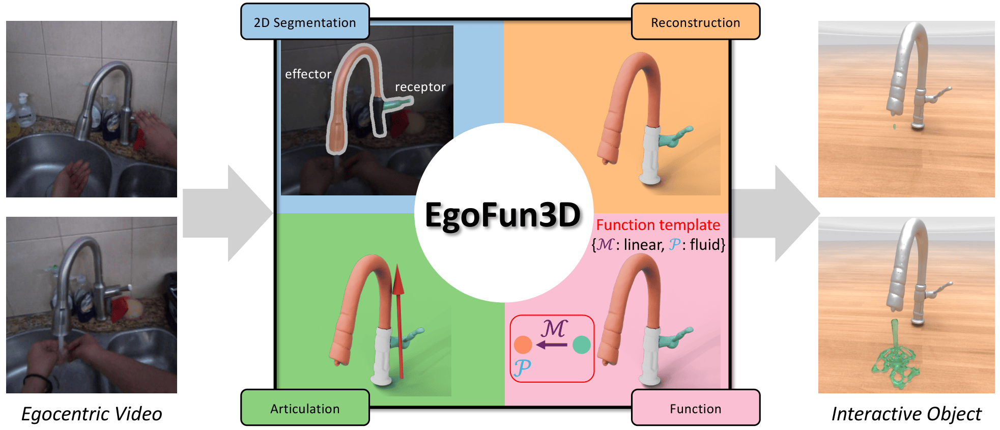

<div align="center">
<h1>EgoFun3D: Modeling Interactive Objects from Egocentric Videos using Function Templates</h1>
<a href="docs/static/pdf/Part_Function_Reconstruction_from_Egocentric_Videos_arxiv.pdf"></a>
<!-- <a href="https://arxiv.org/abs/2509.13414"></a> -->
<a href="https://3dlg-hcvc.github.io/EgoFun3D/"></a>
<!-- <a href="https://x.com/Nik__V__/status/1968316841618518371"></a> -->
<a href="https://huggingface.co/datasets/3dlg-hcvc/EgoFun3D"></a>
<br>
<br>
<strong>
<a href="https://willipwk.github.io/">Weikun Peng</a>
&nbsp;&nbsp;
<a href="https://diliash.github.io/">Denys Iliash</a>
&nbsp;&nbsp;
<a href="https://msavva.github.io/">Manolis Savva</a>

Simon Fraser University
</strong>

</div>




## Installation
1. Clone this repo
   ```bash
   git clone --recursive git@github.com:3dlg-hcvc/EgoFun3D.git
   ```
2. Prepare a conda environment
   ```bash
   cd part_function_reconstruction
   bash install.sh
   ```
   There are many different modules in this project. Thus, pip will notify you several incompatible issues during installation. Usually this is not a big problem. Make sure several key packages satisfy the following version.
   ```txt
   torch==2.9.1
   transformers==4.57.6
   vllm==0.15.1
   numpy==1.26.4
   ```
3. Download EgoFun3D dataset.
   ```bash
   hf download 3dlg-hcvc/EgoFun3D --repo-type dataset --local-dir full_dataset
   ```
4. Setup environment variable.
   ```bash
   export GEMINI_API_KEY=$YOUR_GEMINI_API_KEY
   export OPENAI_API_KEY=$YOUR_OPENAI_API_KEY
   export VLLM_WORKER_MULTIPROC_METHOD=spawn
   ```

## Run the Benchmark
### Segmentation
The segmentation flow is:
1. Run the selected segmentation model on 20 seed frames.
2. Propagate those masks to all frames with SAM3.
3. Save one mask archive per role in `segmentation_masks.h5`.
4. Use those saved results in the downstream evaluation scripts.

Use `eval_segmentation.py` for the staged release workflow. By default the release segmentation configs use `segmentation.frame_subsample=20` and `segmentation.propagate_with_sam3=true`.

Example:
```bash
python eval_segmentation.py segmentation=VisionReasoner vlm_segmentation=gemini_segmentation
```

If you want to run segmentation with ground-truth part labels instead of VLM-predicted labels:
```bash
python eval_segmentation.py gt_labels=true segmentation=VisionReasoner
```

If you want Gemini part labels precomputed instead of queried during segmentation, first cache the VLM output:
```bash
python eval_segmentation.py \
  vlm_only=true \
  save_shared_vlm=true \
  segmentation=VisionReasoner \
  vlm_segmentation=gemini_segmentation
```

Then run segmentation from the cached labels:
```bash
python eval_segmentation.py \
  from_shared_vlm=true \
  disable_vlm_calls=true \
  segmentation=VisionReasoner \
  vlm_segmentation=gemini_segmentation
```

To run SAM3 Agent segmentation, you need to run vllm first, and then run the segmentation script. We recommend to run VLM on one GPU and segmentation on another GPU to prevent OOM.
```bash
CUDA_VISIBLE_DEVICES=1 vllm serve Qwen/Qwen3-VL-8B-Thinking --max-model-len 65536 --port 8001 &
VLLM_PID=$!

# Wait for the server to be ready
until curl -s http://localhost:8001/health > /dev/null 2>&1; do
    echo "Waiting for vLLM server to start..."
    sleep 10
done
echo "vLLM server is ready!"

python eval_segmentation.py save_shared_vlm=true segmentation=SAM3Agent

kill $VLLM_PID
wait $VLLM_PID 2>/dev/null
```

Results are saved under `outputs/{exp_name}/{time}/{video_name}/segmentation/`.

### Reconstruction
The reconstruction flow is:
1. Load 2D segmentation results from the previous step or from the dataset.
2. Running reconstruction on the input videos.
3. Aligning moving parts to the initial state using RoMa.
4. Build meshes.

To run reconstruction on the ground truth 2D segmentation
```bash
python eval_reconstruction.py reconstruction=da3
```
To run reconstruction on the predicted 2D segmentation
```bash
python eval_reconstruction.py reconstruction=da3 pred_mask=True segmentation_results_dir={YOUR SEGMENTATION RESULTS PATH}
```
You can switch reconstruction method to `mapanything` or `vipe`.

Results are saved under `outputs/{exp_name}/{time}/{video_name}/reconstruction/`.

### Articulation Estimation
The articulation estimation will take the reconstruction results as input and estimate articulation parameters. Thus, please run reconstruction before running articulation estimation.

To run articulation estimation on the ground truth 2D segmentation
```bash
python eval_articulation.py articulation=iTACO reconstruction_results_dir={YOUR RECONSTRUCTION RESULTS PATH}
```
Similarly, to run articulation estimation on the predicted 2D segmentation
```bash
python eval_articulation.py articulation=iTACO reconstruction_results_dir={YOUR RECONSTRUCTION RESULTS PATH} pred_mask=True segmentation_results_dir={YOUR SEGMENTATION RESULTS PATH}
```
You can switch articulation method to `Artipoint`

Results are saved under `outputs/{exp_name}/{time}/{video_name}/articulation/`.

### Function Prediction
The function template prediction first marks the receptor and effector in different colors on the original video and query VLMs for function template prediction.
```bash
python eval_function.py vlm_function=gemini_function
```
You can switch articulation method to `gpt_function`, `qwen_function`, or `molmo_function`.

Results are saved under `outputs/{exp_name}/{time}/{video_name}/function/`.

## Run the Full Pipeline

### Pipeline demo (single video)
`pipeline.py` runs the complete pipeline on an arbitrary video file with no UI.
Part labels are auto-detected by a Qwen VLM if not supplied; pass `--gemini_key` to use Gemini instead.

```bash
python pipeline.py \
    --video /path/to/video.mp4 \
    --output_dir /path/to/outputs
```

Supply part labels directly to skip VLM auto-detection:
```bash
python pipeline.py \
    --video /path/to/video.mp4 \
    --output_dir /path/to/outputs \
    --receptor "faucet handle" \
    --effector "faucet spout"
```

Override the segmentation config (default: VisionReasoner) or VLM function config:
```bash
python pipeline.py \
    --video /path/to/video.mp4 \
    --output_dir /path/to/outputs \
    --seg_config config/segmentation/MolmoSAM.yaml \
    --vlm_function_config config/vlm_function/gemini_function.yaml
```

Outputs follow the evaluation suite layout (`reconstruction/`, `articulation/`, `function/`, `compile/`).

### Interactive demo (Gradio)
We also provide a Gradio interface to run the full pipeline interactively.
```bash
python gradio.py
```

## Compilation
Once we get all necessary results from previous steps, we can compile the executable function script to run in physics simulators. Currently we support compiling fluid and geometry functions. The fluid function executes in Genesis and the geometry function executes in Isaac Sim.

For Genesis, simply run
```bash
pip install genesis-world==0.4.4
```

For Isaac Sim, we run it through Isaac Lab. Therefore, please follow [Isaac Lab Installation Guidance](https://isaac-sim.github.io/IsaacLab/main/source/setup/installation/pip_installation.html) to prepare Isaac Lab environment. We suggest you creating another conda environment to run Isaac Lab.

To compile executable function script, run
```bash
python compile/compile.py --reconstruction_dir {PATH TO RECONSTRUCTION DIR} --articulation_dir {PATH TO ARTICULATION DIR} --function_dir {PATH TO FUNCTION DIR} --output_dir {PATH TO EXECUTABLE FUNCTION SCRIPT OUTPUT DIR}
```
Please refer to `compile/compile.py` for more information on input parameters.

After getting the URDF and function script, for fluid function, you can simply run the script. For geometry function, you can move the URDF and the script to the `IsaacLab/scripts/tutorials/01_assets/` folder, then convert URDF to USD by running 
```bash
./isaaclab.sh -p scripts/tools/convert_urdf.py PATH_TO_URDF OUTPUT_PATH_TO_USD
```
and also modify the USD path in the function script. Finally, you can test the function script by running
```bash
./isaaclab.sh -p scripts/tutorials/01_assets/{YOUR_SCRIPT_NAME}
```

## Acknowledgment
This work was funded in part by a Canada Research Chair, NSERC Discovery Grant, and enabled by support from the Digital Research Alliance of Canada. The authors would like to thank Tianrun Hu from National University of Singapore for collecting data, Jiayi Liu, Xingguang Yan, Austin T. Wang, and Morteza Badali for valuable discussions and proofreading.

This codebase is built on top of [VisionReasoner](https://github.com/JIA-Lab-research/VisionReasoner), [Sa2VA](https://github.com/bytedance/Sa2VA), [X-SAM](https://github.com/wanghao9610/X-SAM), [Molmo2](https://github.com/allenai/molmo2), [Qwen3-VL](https://github.com/QwenLM/Qwen3-VL), [SAM2](https://github.com/facebookresearch/sam2), [SAM3](https://github.com/facebookresearch/sam3), [Depth-Anything-3](https://github.com/ByteDance-Seed/depth-anything-3), [Map-Anything](https://github.com/facebookresearch/map-anything), [ViPE](https://github.com/nv-tlabs/vipe), [Artipoint](https://github.com/robot-learning-freiburg/artipoint), [iTACO](https://github.com/3dlg-hcvc/video2articulation). We thank the authors for open sourcing these invaluable projects.

## Citation
If you find our project to be useful, please cite our paper
```bibtex
@article{peng2026egofun3d,
  title={{EgoFun3D: Modeling Interactive Objects from Egocentric Videos using Function Templates}},
  author={Peng, Weikun and Iliash, Denys and Savva, Manolis},
  journal={arxiv preprint},
  year={2026}
}
```
